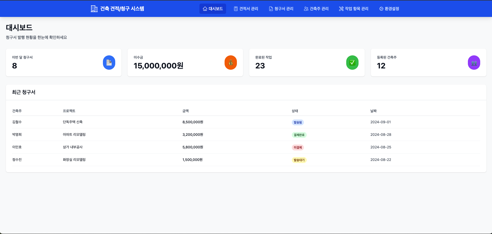

# 🎯 건설 청구서 관리 시스템 PPT 가이드

## 📁 생성된 파일 목록

### 1. **final-presentation.html** (메인 PPT)
- **설명**: 실제 스크린샷이 포함된 완성된 프레젠테이션
- **슬라이드 수**: 18개
- **특징**: 실제 이미지 포함, 인쇄 최적화, 키보드 네비게이션
- **사용법**: 브라우저에서 열어서 전체화면으로 발표

### 2. **presentation.html** (템플릿 버전)
- **설명**: 스크린샷 플레이스홀더가 있는 기본 템플릿
- **용도**: 다른 프로젝트에 재활용 가능

### 3. **presentation-notes.md** (발표 노트)
- **설명**: 슬라이드별 발표 포인트 및 시간 배분
- **포함 내용**: 예상 질문, 데모 시나리오, 발표 팁

### 4. **screenshot-guide.md** (촬영 가이드)
- **설명**: 스크린샷 촬영 방법 및 품질 기준
- **포함 내용**: 15개 화면별 촬영 포인트

### 5. **user-manual.md** (상세 매뉴얼)
- **설명**: 시스템 전체 사용법 문서
- **용도**: 고객 제공용 상세 가이드

## 🚀 사용 방법

### 1. PPT 열기
```bash
# 브라우저에서 직접 열기
open final-presentation.html
# 또는
double-click final-presentation.html
```

### 2. 발표 모드
- **전체화면**: F11 또는 브라우저 전체화면 모드
- **네비게이션**: 
  - 다음 슬라이드: Page Down, 아래 화살표
  - 이전 슬라이드: Page Up, 위 화살표

### 3. 인쇄/PDF 변환
- **브라우저에서**: Ctrl+P (Windows) / Cmd+P (Mac)
- **PDF로 저장**: 인쇄 대화상자에서 "PDF로 저장" 선택

## 🎨 커스터마이징 가이드

### 스타일 수정
```css
/* 색상 변경 */
.title-slide {
    background: linear-gradient(135deg, #your-color1, #your-color2);
}

/* 폰트 변경 */
body {
    font-family: 'Your-Font', sans-serif;
}
```

### 슬라이드 추가
```html
<div class="slide">
    <h1>새 슬라이드 제목</h1>
    <!-- 내용 추가 -->
</div>
```

### 이미지 교체
```html
<!-- 기존 -->


<!-- 새 이미지로 교체 -->

```

## 📊 발표 시 권장사항

### 기술 준비
1. **듀얼 모니터**: PPT + 실제 시스템 동시 표시
2. **인터넷 연결**: 시스템 데모를 위해 필수
3. **백업 계획**: PDF 버전 및 오프라인 자료 준비

### 발표 전략
1. **시간 배분**: 총 20-30분, 질문 시간 포함
2. **청중 참여**: 각 기능별로 질문 유도
3. **실무 연결**: 청중의 실제 업무와 연결

### 데모 준비
1. **샘플 데이터**: 실제 건설업계 용어 사용
2. **시나리오**: 신규 프로젝트 → 견적 → 청구 흐름
3. **문제 상황**: 일반적 사용 오류 및 해결책

## 🔧 문제 해결

### 이미지가 안 보이는 경우
1. **경로 확인**: screenshots 폴더 위치 확인
2. **파일명 확인**: 대소문자 정확히 일치해야 함
3. **권한 확인**: 파일 읽기 권한 있는지 확인

### 레이아웃 깨지는 경우
1. **브라우저 업데이트**: 최신 Chrome/Firefox 사용
2. **확대/축소**: 100% 배율로 조정 (Ctrl+0)
3. **캐시 삭제**: 브라우저 캐시 및 쿠키 삭제

### 인쇄 시 문제
1. **여백 설정**: 브라우저 인쇄 설정에서 여백 최소화
2. **페이지 나누기**: CSS의 page-break-after 속성 확인
3. **배경색**: 인쇄 옵션에서 "배경 그래픽" 체크

## 📈 PPT 개선을 위한 피드백 포인트

### 발표 후 확인사항
- [ ] 시간 배분이 적절했는가?
- [ ] 기술적 문제는 없었는가?
- [ ] 청중의 관심도는 어땠는가?
- [ ] 질문에 적절히 답변했는가?

### 개선 포인트
1. **콘텐츠**: 업계별 맞춤 내용
2. **시각화**: 더 많은 차트 및 그래프
3. **인터랙션**: 실시간 투표, 퀴즈 등
4. **개인화**: 청중별 관심사 반영

## 🎯 목표 달성 지표

### 발표 성공 기준
- **이해도**: 80% 이상이 시스템 이해
- **관심도**: 50% 이상이 추가 정보 요청
- **참여도**: 활발한 질문 및 토론
- **만족도**: 전반적으로 긍정적 피드백

### 후속 조치
- **체험판 신청**: 참석자의 30% 이상
- **미팅 요청**: 10% 이상의 개별 미팅
- **추천**: 타 업체 추천 의향

## 🚀 다음 단계

### 즉시 가능한 활용
1. **웨비나**: 온라인 발표로 더 많은 청중 대상
2. **영상 제작**: 설명 음성 추가하여 동영상 버전
3. **다국어**: 영어 버전 제작으로 해외 진출

### 장기 개선 계획
1. **인터랙티브**: JavaScript로 클릭 가능한 데모
2. **개인화**: 업종별 특화 버전 제작
3. **자동화**: 실제 데이터 연동으로 실시간 업데이트

---

**💡 Tip**: 이 PPT는 HTML 기반이므로 웹에서 공유하기 쉽고, 모든 플랫폼에서 동일하게 보입니다. 필요에 따라 PowerPoint로 변환도 가능합니다!